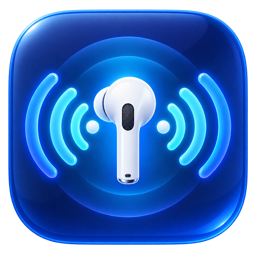

<p align="center">
  
</p>

# AirPods Control

AirPods Control is a macOS menu-bar app that turns AirPods head motion into custom actions. Record natural head gestures, recognize them through live headphone-motion data, and use them to launch apps, send keyboard shortcuts, arrange windows, or control volume and brightness.

## Download

[**→ Download AirPods Control from the latest release**](https://github.com/Smoep/airpod_control/releases/latest)

Download the ZIP, unzip it, and drag **AirPods Control.app** to your Applications folder.

> **First launch:** release builds are not notarized. Right-click (or Control-click) **AirPods Control.app**, choose **Open**, then confirm **Open**. macOS may also request Motion, Accessibility, or Automation permission when a feature first needs it.

## What it does

- Captures live orientation and acceleration from compatible AirPods through Core Motion
- Connects motion automatically at launch and reconnects after the headphones return
- Records trainable discrete gestures using yaw, pitch, roll, and short translation impulses
- Supports an **Fn Key** activation layer or tuned **Always On** recognition
- Provides continuous controls for volume, brightness, desktop switching, and custom shortcuts
- Launches apps, sends keyboard shortcuts, and moves or resizes the focused window
- Shows optional head-position, trail, recognition-score, and diagnostics overlays
- Exports sensor data and backs up trained gestures and recognition settings
- Keeps a bounded live-attempt corpus for evidence-based matcher analysis

## Requirements

- Apple-silicon Mac running macOS 26.4 or newer
- AirPods or compatible headphones that expose headphone motion through Apple's Core Motion framework
- Xcode 26 or newer when building from source

Some actions require Accessibility or Automation permission. AirPods Control explains the missing permission in Settings when an action cannot run.

## Build from source

```sh
git clone https://github.com/Smoep/airpod_control.git
cd airpod_control
xcodebuild -project airpod_control.xcodeproj \
  -scheme airpod_control \
  -configuration Release \
  -derivedDataPath build-release \
  build \
  CODE_SIGNING_ALLOWED=NO \
  CODE_SIGNING_REQUIRED=NO
ditto "build-release/Build/Products/Release/AirPods Control.app" "/Applications/AirPods Control.app"
open "/Applications/AirPods Control.app"
```

Run the unit tests with:

```sh
xcodebuild test \
  -project airpod_control.xcodeproj \
  -scheme airpod_control \
  -destination 'platform=macOS' \
  -derivedDataPath .build \
  CODE_SIGNING_ALLOWED=NO \
  CODE_SIGNING_REQUIRED=NO \
  -only-testing:airpod_controlTests
```

## Diagnostics

Enable **Settings → Diagnostics → Debug logging** for compact decisions and replay records. The current-session log is written to `/tmp/airpod_control.log`; full-resolution gesture attempts are retained in `~/Library/Application Support/AirpodControl/gesture-attempts.jsonl`. Both files are size-capped.

See [Lessons Learned.md](Lessons%20Learned.md) for confirmed tuning values, useful log markers, and the diagnosis workflow.

## Privacy

Motion samples and trained gestures stay on the Mac. AirPods Control does not include analytics, advertising, accounts, or network upload code. Export and backup files are created only when requested.

## License

AirPods Control is free software released under the [GNU General Public License v3.0](LICENSE).

AirPods is a trademark of Apple Inc. This project is independent and is not affiliated with or endorsed by Apple.
